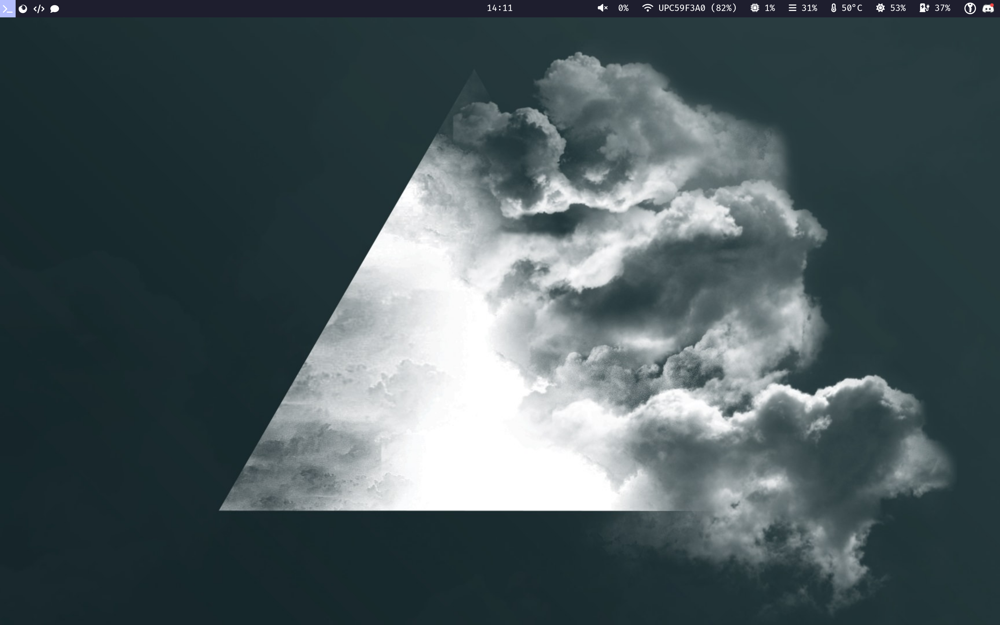
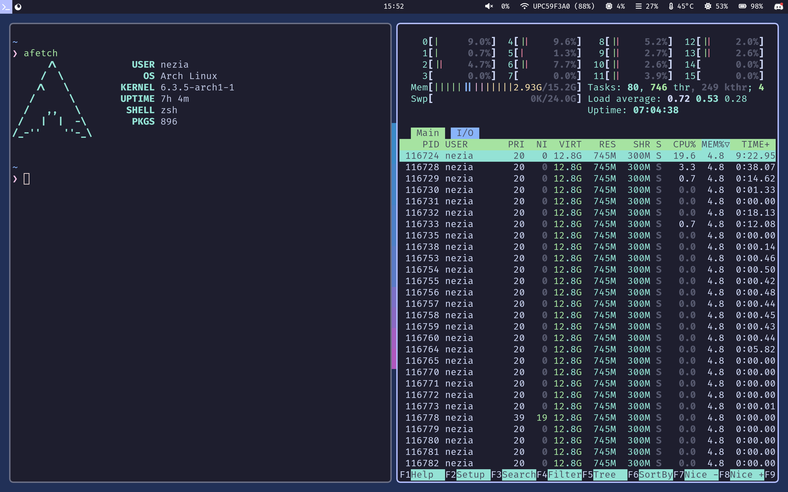

# My dotfiles

- [My dotfiles](#my-dotfiles)
  - [Installing](#installing)
    - [Prerequisites](#prerequisites)
    - [Fedora (desktop)](#fedora-desktop)
    - [Arch (window manager)](#arch-window-manager)
  - [Common software](#common-software)
    - [Theme](#theme)
    - [Shell](#shell)
  - [Window Manager configuration](#window-manager-configuration)
    - [Software used](#software-used)
    - [Services and timers](#services-and-timers)

I use different flavors for my configuration, as I prefer having a window manager on my laptop, and a desktop environment on my desktop. Therefore, the programs installed as well as the configuration files are different for each of them. Currently, it works using the operating system name but I'm currently working on changing it as you might want to use a window manager on Fedora for instance. The different configurations are going to be detailed below.

This configuration uses git submodules in order to integrate my Emacs config from  a separate repository, so make sure to initialize them before trying to install it (installation instructions below).

Since I use 1password as my password manager, I also use it to fetch my GPG key and import it automatically, which is why it's a dependency for my configuration. It expects a document called `gpg key`in the `Personal` vault.

## Installing

### Prerequisites

- [git](https://git-scm.com)
- [chezmoi](https://chezmoi.io)
- [1Password](https://1password.com) and the [1Password CLI](https://developer.1password.com/docs/cli) (these dependencies will eventually become completely optional if you are not using it)

**As of today, only Fedora is supported (with the desktop flavor) and Arch Linux (with the window manager flavor). The installation process for both of them is similar:**

### Fedora (desktop)

`FLAVOR=desktop chezmoi init --apply https://github.com/nezia1/dotfiles`

### Arch (window manager)

`FLAVOR=wm chezmoi init --apply https://github.com/nezia1/dotfiles`

## Common software

### Theme

I use [catppuccin](https://github.com/catppuccin/catppuccin) as my theme
(the mocha variant). I love the soothing pastel colors. The GTK theme
and the Qt5 theme are also configured to be used with supported
applications.

### Shell

I use [fish](https://github.com/fish-shell/fish-shell) as my interactive shell, but I still keep [bash](https://www.gnu.org/software/bash/) as my non-interactive shell for compatibility purposes, as some pieces of software that I use require the user to have a POSIX compliant shell. This is why I have a bash module, where I setup everything that I want to have non-interactively and interactively and if running interactively, have it start a fish session.

## Window Manager configuration

This is my laptop configuration. I like using window managers as it optimizes my screen space, and the keybindings are extremely convenient when using a trackpad compared to using a mouse.

 

### Software used

- Operating system: [Arch Linux](https://archlinux.org/)
- Window manager: [Hyprland](https://hyprland.org)
- Status bar: [Waybar](https://github.com/Alexays/Waybar)
- Application launcher: [wofi](https://sr.ht/~scoopta/wofi/)
- Terminal emulator: [kitty](https://github.com/kovidgoyal/kitty)
- Shell: [fish](https://github.com/fish-shell/fish-shell)
- Text editor: [Emacs](https://www.gnu.org/software/emacs/)
- Notification daemon: [dunst](https://github.com/dunst-project/dunst)
- Password manager: [pass](https://www.passwordstore.org/)

Hyprland is configured to use a random wallpaper from the
`$HOME/.dotfiles` directory, so you need to have your wallpapers in it.

### Services and timers

The user-services module contains different systemd daemons and timers
that you might or might not need depending on your specific use-case:

- sync: a systemd timer that synchronizes my org directory using
    [rclone](https://rclone.org/) to a remote called drive (runs every 5
    minutes)
